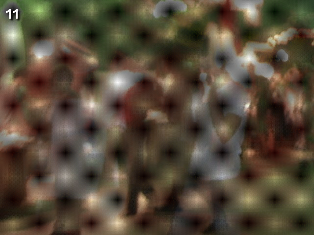

    
    <h1>pythonchallenge.com</h1>

-   [1 - Map](1%20-%20Map.py)
-   [2 - OCR](2%20-%20OCR.py)
-   [3 - Equality](3%20-%20Equality.py)
-   [4 - linkedlist](4%20-%20linkedlist.py)
-   [5 - Peak Hell](5%20-%20Peak%20Hell.py)
-   [6 - Channel](6%20-%20Channel.py)
-   [7 - Oxygen](7%20-%20Oxygen.py)
-   [8 - Integrity](8%20-%20Integrity.py)
-   [9 - Good](9%20-%20Good.py)
-   [10 - Bull](10%20-%20Bull.py)
-   [11 - 5808](11%20-%205808.py)
-   [12 - Evil](12%20-%20Evil.py)
-   [13 - Disproportional](13%20-%20Disproportional.py)
-   [14 - Italy](14%20-%20Italy.py)
