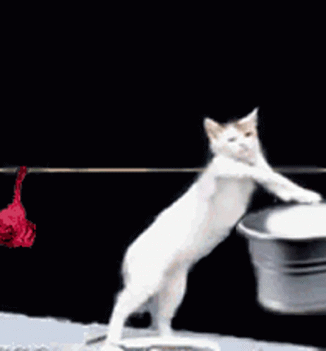

    
    <h1>the honk</h1>

> Big code dump. BTEC [The Bonk](https://github.com/GD-NTB/the-bonk). Anything that does not deserve its own repository goes here.

Last updated: 29/11/2023

I do not promise everything will work in here, however if you have any questions about the contents of the honk, don't be scared to [reach out to me on Discord (:](https://discord.gg/62kNFYBvKB)

There is a lot of maths in here, be warned.

### Table of contents

-   [Python](python)
-   [C++](c++)
-   [GCSE Computer Science](school/gcse)
-   [A-Level Computer Science](school/a-level)
-   [Royal Institute Computer Science Masterclass 2021](school/royal%20institute)
