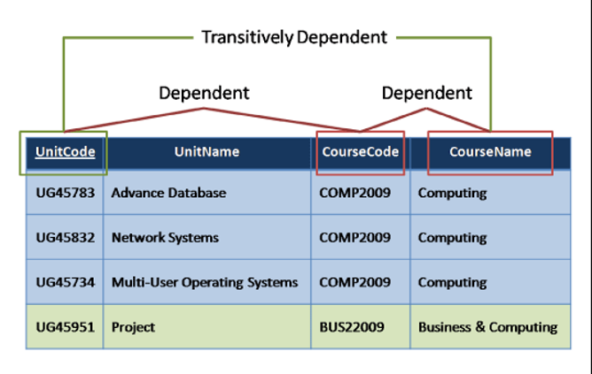

# Database Normalisation

Database normalisation is a systematic approach of decomposing tables to eliminate data redundancy and undesirable characteristics like Insertion, Update, and Deletion anomalies.

It is a multi-step process that puts data into tabular form by removing duplicated data from the relation tables.

Each degree of normalisation depends on the previous one first being satisfied.

## Requirements

### 1NF

- No two tuples may contain a repeating group of information

### 2NF

- There must not be any partial dependency of any column on a primary key

### 3NF

- Every non-prime attribute of the table must be dependent on the primary key
- Transistive functional dependency must be removed

